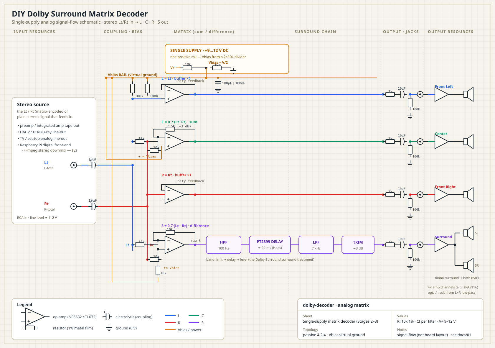

# dolby-decoder

A DIY project for decoding the Dolby family of surround formats — in **software** and in
**hardware**. It ships with:

- ⚡ **A working matrix surround decoder in pure-Python** (`dolbydec/`) you can run right now —
  it decodes a stereo **Lt/Rt** signal into real **L / C / R / S** channels (or a 5.1 bus),
  the same sum-and-difference matrix a Dolby Surround / Pro Logic decoder uses. No
  dependencies, no numpy — just Python 3. See [Quick start](#quick-start-software-decoder).
- 📐 **A hardware build guide** (`docs/`) for building the analog version from op-amps and a
  delay chip, plus the realistic path for the digital formats (Dolby Digital / DD+ / TrueHD)
  and an honest account of where **Atmos** hits a hard wall.

> **Read this first — the honest scope.** "Build a Dolby decoder" spans two very different
> worlds. One half (the analog *matrix* surround formats) is a rewarding project you can build
> in **software** (this repo's `dolbydec/`) *or* from op-amps. The other half (the digital,
> discrete, and object-based formats — Dolby Digital, DD+, TrueHD, **Atmos**) cannot be legally
> or practically *decoded from scratch* by a hobbyist: the bitstreams are patented and the
> decoders are licensed. This project is honest about that line. See
> [What you can and can't build](#what-you-can-and-cant-build).

## Quick start (software decoder)

No install, no dependencies — Python 3.9+:

```bash
# 1. Make a matrix-encoded test signal (4 tones folded into stereo Lt/Rt)
python3 -m dolbydec demo -o demo.wav

# 2. Decode it back into 5.1 (FL FR FC LFE SL SR)
python3 -m dolbydec decode demo.wav -o out_5_1.wav

# 3. ...or split into separate L / C / R / S channel files
python3 -m dolbydec decode demo.wav --split out/

# Decode any real stereo (or Dolby-Surround-encoded) WAV you have:
python3 -m dolbydec decode your_stereo.wav -o your_5_1.wav
```

Run the test suite (pure stdlib, no pytest required):

```bash
python3 tests/test_decode.py     # or: python3 -m pytest tests/
```

The decoder achieves ~40 dB of matrix separation on the reference signal — center content
cancels in the surround channel and vice-versa, exactly as the analog circuit does. How it maps
to the hardware is documented in [§6 · The software decoder](docs/06-software-decoder.md).

> **Read this first — the honest scope.** "Build a Dolby decoder" spans two very different
> worlds. One half (the analog *matrix* surround formats) is a rewarding weekend electronics
> project you can build from op-amps and a delay chip. The other half (the digital, discrete,
> and object-based formats — Dolby Digital, DD+, TrueHD, **Atmos**) cannot be legally or
> practically *decoded from scratch* by a hobbyist: the bitstreams are patented and the
> decoders are licensed. This guide is honest about that line and shows you the best
> *practical* path on each side of it. See [What you can and can't build](#what-you-can-and-cant-build).

## What you can and can't build

| Format | Era | How it's coded | DIY-buildable decoder? |
|---|---|---|---|
| **Dolby Surround / Pro Logic** | 1982– | 4:2:4 **analog matrix** (phase/amplitude) | ✅ **Yes — build it from scratch.** This is the core project. |
| **Pro Logic II / IIx** | 2000– | Active **matrix** + steering | 🟡 Passive/basic active version buildable; full logic-steering is complex but doable in DSP. |
| **Dolby Digital (AC-3)** | 1991– | **Discrete** compressed bitstream (patented) | 🟡 Not from scratch — but decodable in software (FFmpeg) on a Pi. |
| **Dolby Digital Plus (E-AC-3)** | 2004– | Discrete, extended | 🟡 Software-decodable (FFmpeg). |
| **Dolby TrueHD (MLP)** | 2006– | **Lossless** discrete | 🟡 Software-decodable (FFmpeg) — core audio only. |
| **Dolby Atmos** | 2012– | **Object-based** metadata on a TrueHD/DD+ core | ❌ **No open decoder exists.** You get the bed/core, not the objects. |

The rule of thumb: **matrix = buildable electronics; discrete/object = licensed software you
run, not build.** This guide covers both honestly.

## Guide contents

1. **[Formats primer](docs/00-formats-primer.md)** — how each Dolby format actually encodes
   audio, and why that determines whether you can decode it yourself.
2. **[The analog matrix decoder](docs/01-analog-matrix-decoder.md)** — ⭐ the main hardware
   build. Passive Hafler matrix → active op-amp matrix → full Dolby-Surround-style processing
   (band-limit, delay, noise reduction). Schematics, part values, assembly, calibration.
3. **[Digital formats on a Raspberry Pi](docs/02-digital-formats-rpi.md)** — the practical path
   for Dolby Digital / DD+ / TrueHD: HDMI audio extraction, HDCP realities, FFmpeg decode to
   multichannel PCM, feeding your amps.
4. **[The Atmos reality](docs/03-atmos-reality.md)** — why object audio can't be DIY-decoded,
   what you actually get from the core, and the closest legitimate approaches.
5. **[Bill of materials & tools](docs/04-bom-and-tools.md)** — consolidated shopping list and
   cost estimate for the analog build and the digital build.
6. **[Safety & legal](docs/05-safety-and-legal.md)** — mains safety, patents, HDCP, and what
   "DIY" does and doesn't entitle you to.
7. **[The software decoder](docs/06-software-decoder.md)** — how the `dolbydec/` code implements
   the same matrix in Python, module by module, mapped to the analog stages.

## Repository layout

```
dolbydec/            the software decoder (pure stdlib Python)
  wavio.py           WAV read/write (16/24/32-bit PCM)
  dsp.py             biquad filters + delay line (the analog filter/delay stages)
  decode.py          the L/C/R/S matrix + surround processing chain
  encode.py          the inverse matrix (to make test material)
  __main__.py        the `python3 -m dolbydec` CLI
tests/test_decode.py round-trip + separation tests
docs/                the hardware build guide (this table of contents)
docs/schematic.svg   full color-coded signal-flow schematic (input → matrix → output)
```

## Schematic

The full analog decoder as a single-supply signal-flow schematic — stereo **Lt/Rt** in through
the matrix and surround chain, out to the amp channels and speakers, with the input and output
resources drawn in:



Details, part values, and calibration are in [§1 · The analog matrix decoder](docs/01-analog-matrix-decoder.md).

## Suggested build order

1. Start with the **passive Hafler matrix** ([§1](docs/01-analog-matrix-decoder.md#stage-1--the-passive-hafler-matrix)) —
   zero power, 30 minutes, an audible surround effect you can hear tonight.
2. Move to the **active op-amp matrix + center channel**.
3. Add the **surround processing chain** (7 kHz low-pass, ~20 ms delay, NR) to turn a bare
   matrix into a proper Dolby-Surround-style decoder.
4. Once the analog side works, tackle the **Raspberry Pi digital front end** for the modern
   formats.

## Status

- ✅ **Software matrix decoder** — working and tested (`dolbydec/`, `python3 tests/test_decode.py`).
- ✅ **Hardware build guide** — complete for the analog matrix decoder and the digital front end.
- ⬜ **PCB Gerbers** for the analog board — schematics are given as buildable breadboard/protoboard
  designs with real part numbers; KiCad files are a natural next step.
- ⬜ **Raspberry Pi decode service** — the FFmpeg command-line path is documented in
  [§2](docs/02-digital-formats-rpi.md); a packaged `decode.sh` + systemd unit is a TODO.

See the TODO list at the end of each build doc for stretch goals (DSP steering, bass management,
Pi automation).
